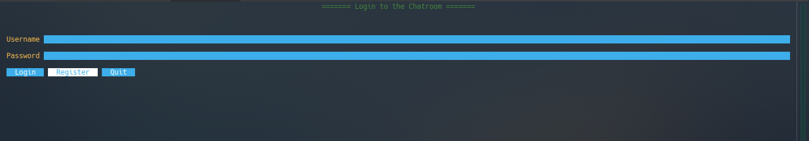
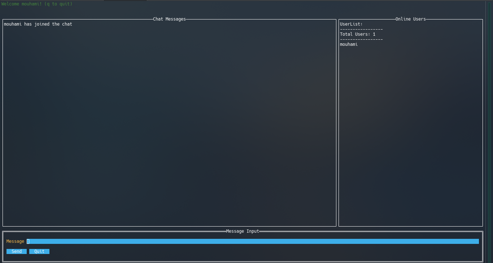
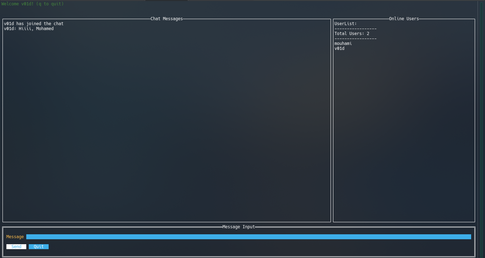

# Project Name: Face Authentication Web Application

## Overview

This project is a **Face Authentication Web Application** built using Go and PostgreSQL. It involves user registration, authentication via facial recognition, and a messaging feature. The app is structured into two main parts: a server that handles all backend operations and a client for user interaction.

The application includes the following key features:
- **Authentication**: Users can authenticate using their face and passphrase.
- **Registration**: Users can register their face and passphrase for secure login.
- **Messaging**: Users can send and receive messages in a secure environment.

## Screenshots

### Authentication Screen


### Registration Screen


### Send Messages Screen



## Prerequisites

To run the application, ensure you have the following installed:

- [Go](https://go.dev/doc/install) (version 1.x or higher)
- [PostgreSQL](https://www.postgresql.org/download/) (version 12.x or higher)

## Setup Instructions

### 1. Clone the Repository

```bash
git clone https://github.com/yourusername/yourrepository.git
cd yourrepository
```

### 2. Set Up the Database

Before running the application, set up PostgreSQL:

- Make sure that your PostgreSQL server is running
- Create a new PostgreSQL database.
- Update the credentials in `go_database_conn.go` to match your PostgreSQL configuration.

```go
// go_database_conn.go
const (
    host     = "localhost"
    port     = 5432
    user     = "your-username"      // Update this
    password = "your-password"      // Update this
    dbname   = "your-database-name" // Update this
)
```

### 3. Running the Server

Navigate to the `server` folder and run the server using the following command:

```bash
cd server
go run .
```

This will start the server, which listens for client requests.

### 4. Running the Client

To run the client, navigate to the `appPages` folder and run the following command:

```bash
cd appPages
go run .
```

The client will start, and you can interact with the user interface.

## Usage

Once the server and client are running:

- Navigate to the client interface in your terminal.
- You can register a new user by providing a usernamd and a password.
- For authentication, enter the registered username and password.
- Send and receive messages securely from the messaging interface.
